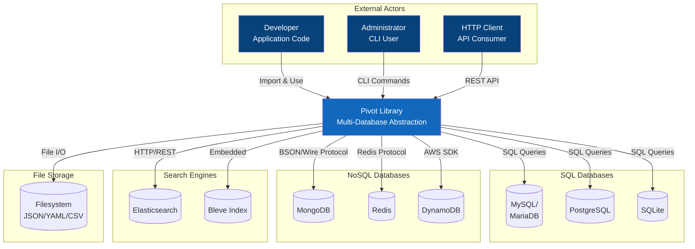
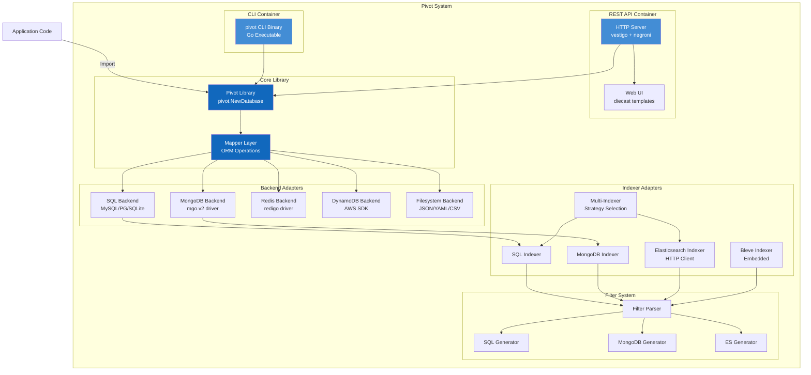
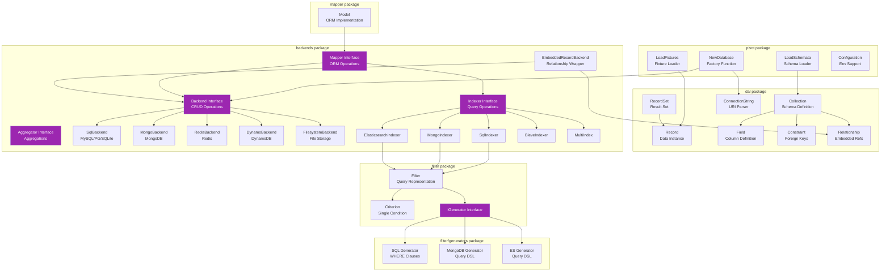
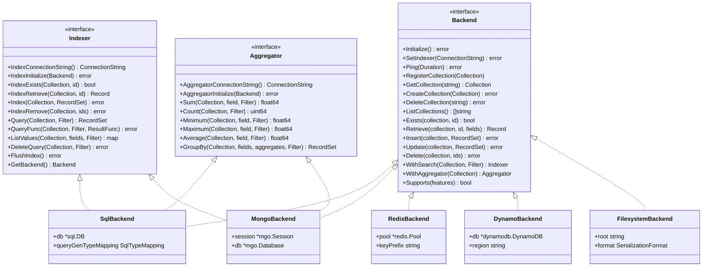

# C4 Architecture Diagrams

This document provides C4 model diagrams showing Pivot's architecture at different levels of abstraction.

## C4 Context Diagram

Shows Pivot in the broader ecosystem with external actors and systems.



## C4 Container Diagram

Shows the runtime containers and their interactions.



## C4 Component Diagram

Shows the internal structure of the core library.



## Backend Interface Hierarchy



## REST API Endpoint Structure

```mermaid
flowchart LR
    subgraph "Status & Metadata"
        S1[GET /api/status]
        S2[GET /api/collections]
        S3[GET /api/schema]
        S4[POST /api/schema]
        S5[GET /api/schema/:collection]
        S6[DELETE /api/schema/:collection]
    end

    subgraph "Query Operations"
        Q1[GET .../query/]
        Q2[POST .../query/]
        Q3[GET .../where/*filter]
        Q4[DELETE .../where/*filter]
        Q5[GET .../aggregate/:fields]
        Q6[GET .../list/*fields]
    end

    subgraph "Record CRUD"
        R1[POST .../records]
        R2[PUT .../records]
        R3[GET .../records/:id]
        R4[POST .../records/:id]
        R5[DELETE .../records/*id]
    end

    API[/api/collections/:collection] --> Q1
    API --> Q2
    API --> Q3
    API --> Q4
    API --> Q5
    API --> Q6
    API --> R1
    API --> R2
    API --> R3
    API --> R4
    API --> R5
```
