# Data Flows

This document describes the key data flows in Pivot using sequence diagrams.

## Query Execution Flow

Shows how a query flows from HTTP request to database and back.

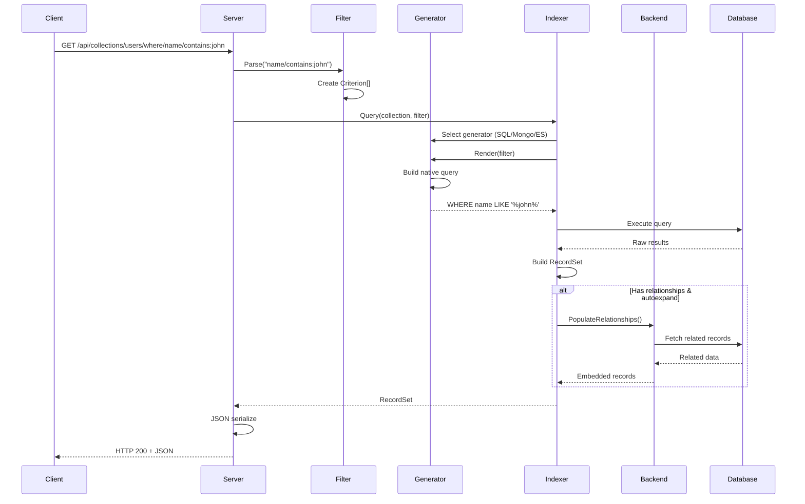

## CRUD Operations

### Create Record

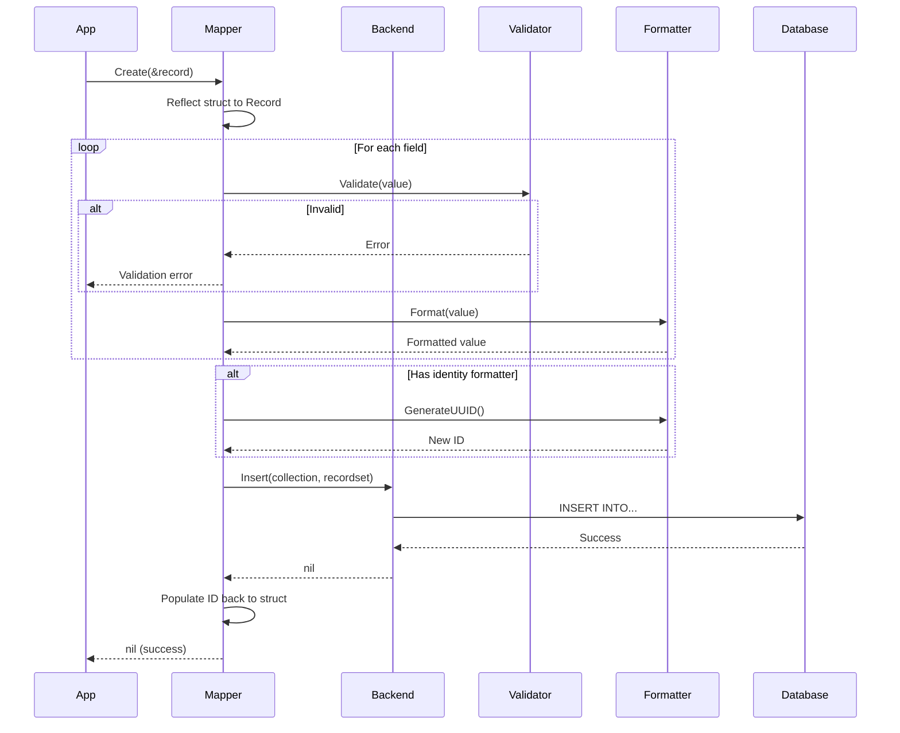

### Read Record

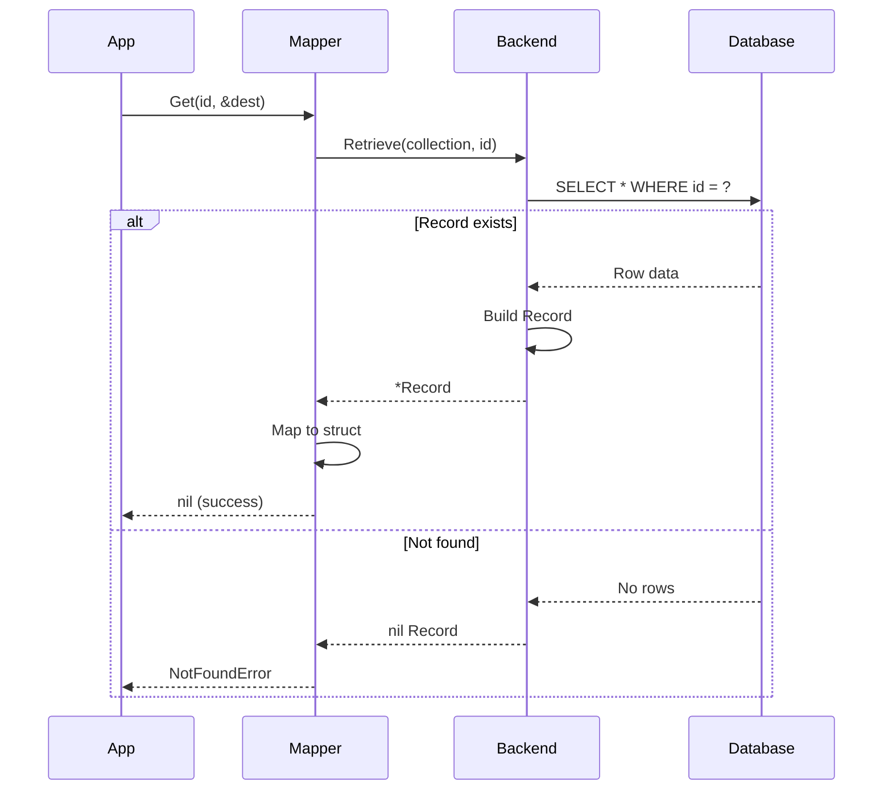

### Update Record

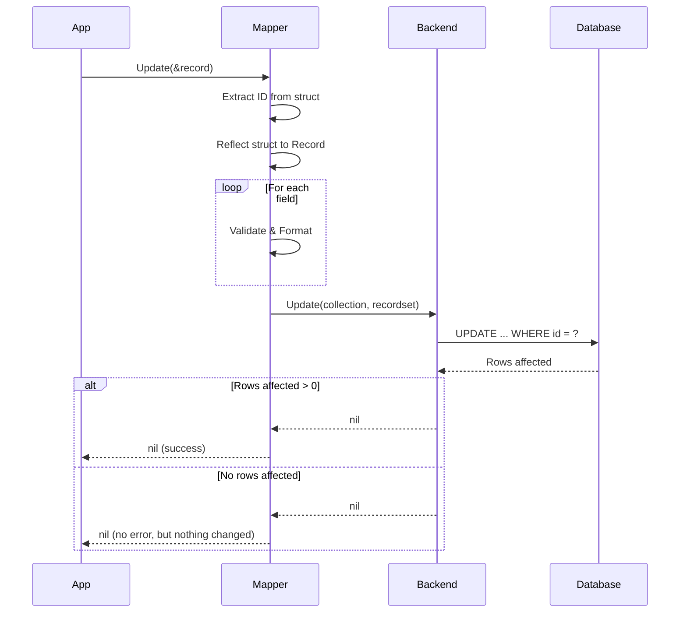

### Delete Record

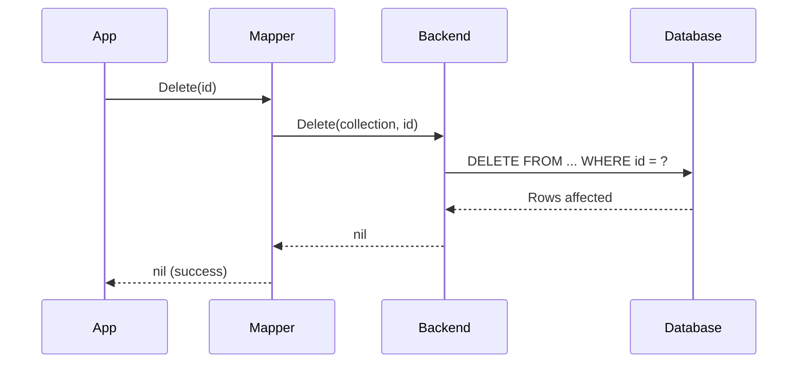

## Filter Compilation Flow

Shows how URL filter syntax compiles to backend-specific queries.

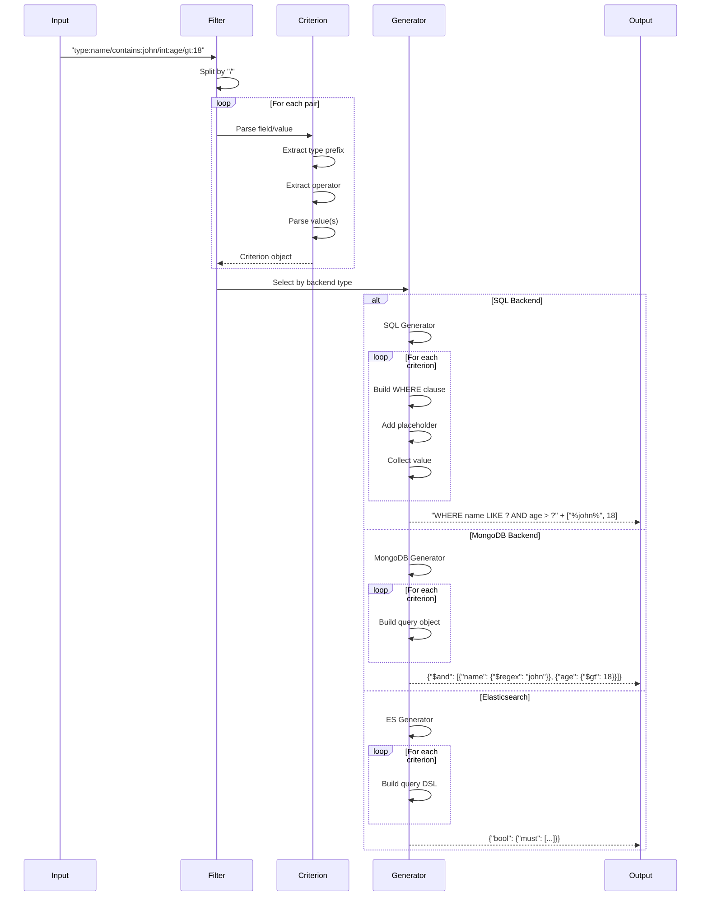

## Relationship Resolution Flow

Shows how embedded collections are resolved.

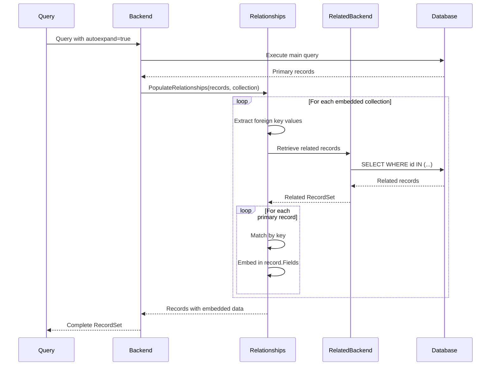

## REST API Request Flow

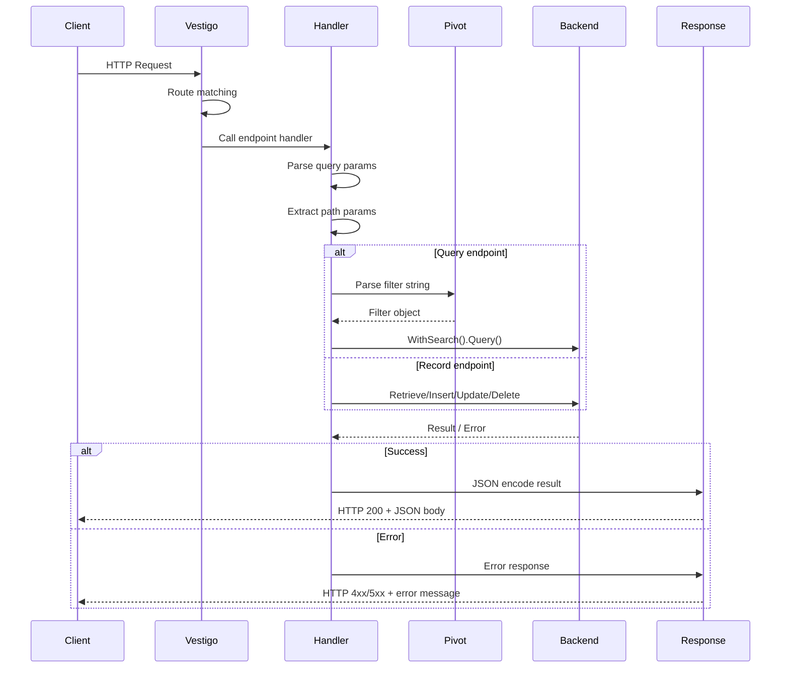

## Multi-Indexer Strategy Flow

Shows how MultiIndex selects and executes across multiple indexers.

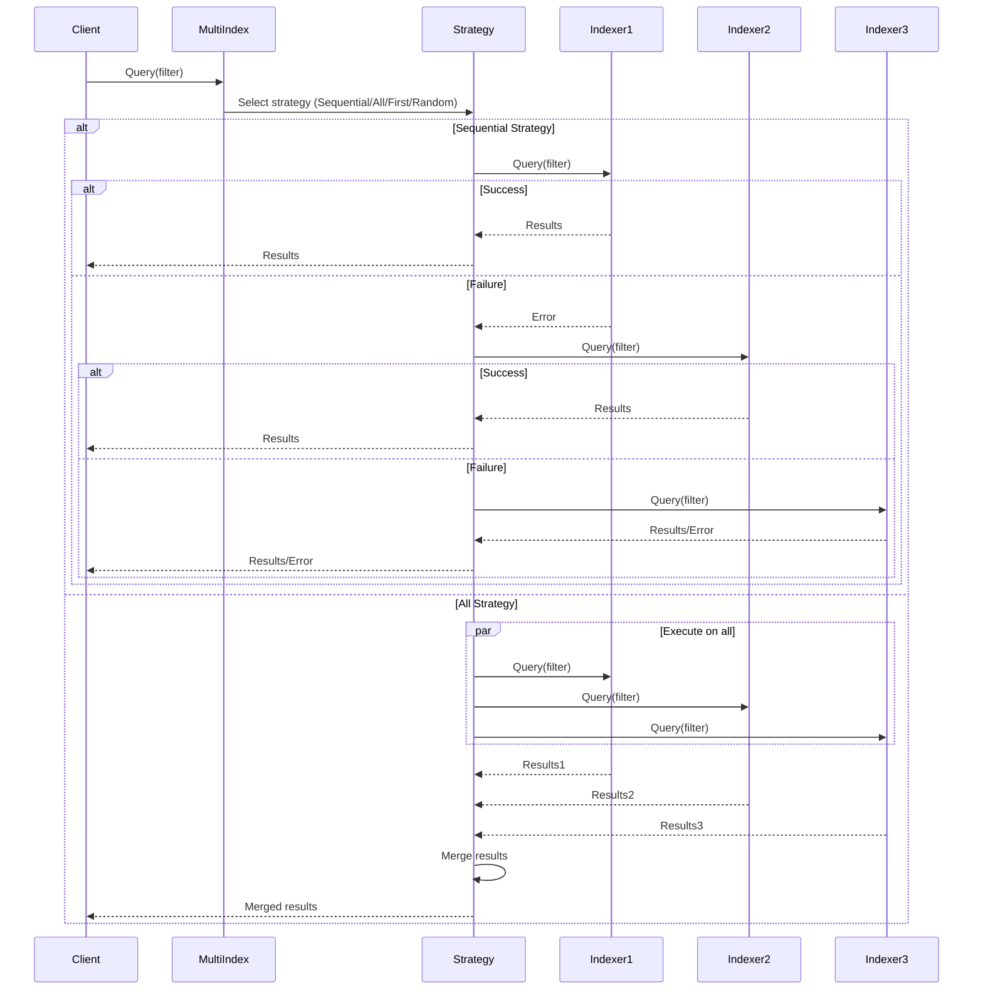

## Schema Migration Flow

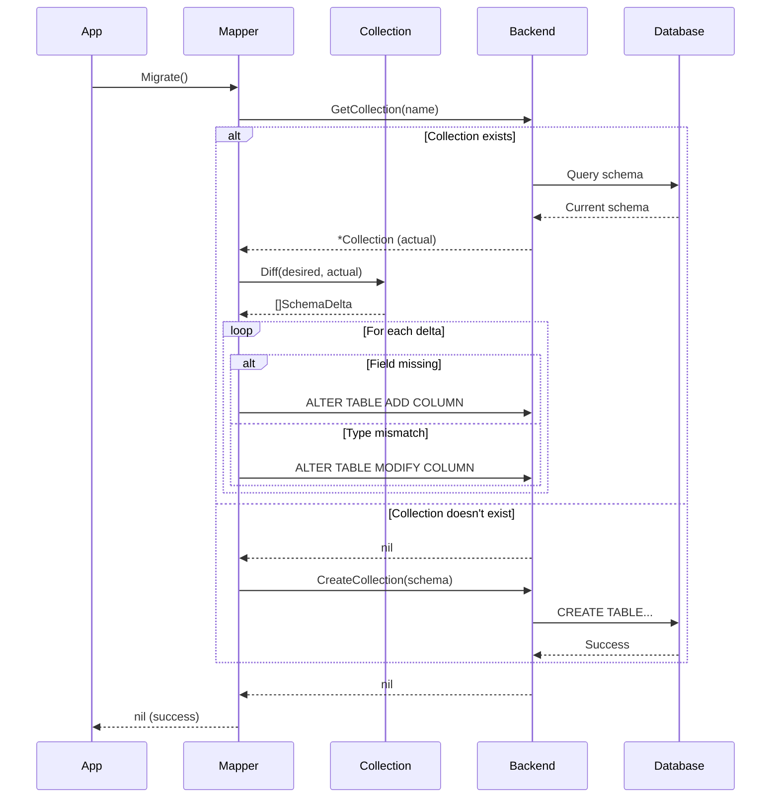

## Composite Key Handling

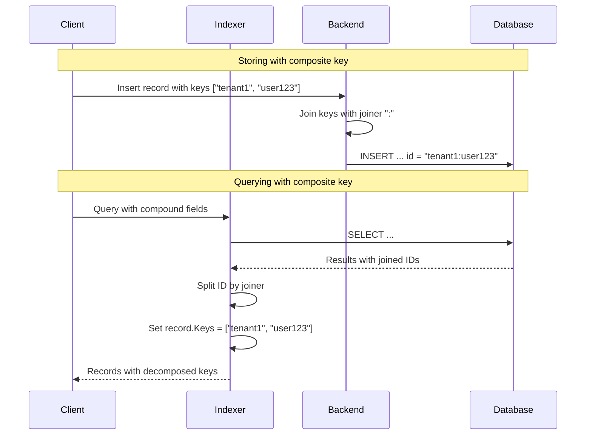
